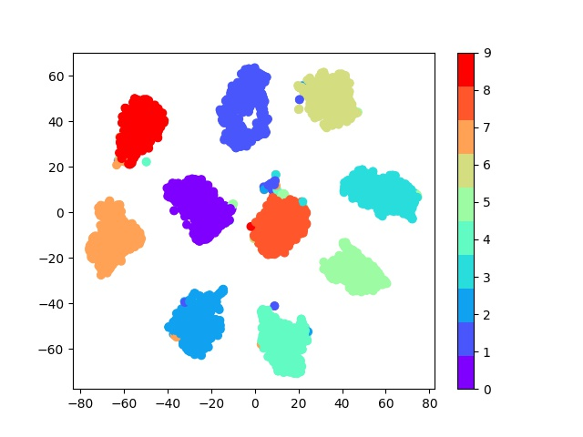

# Deep metric learning using Triplet network in PyTorch

The following repository contains code for training Triplet Network in Pytorch  
Siamese and Triplet networks make use of a similarity metric with the aim of bringing similar images closer in the embedding space while separating non similar ones.  
Popular uses of such networks being -   
* Face Verification / Classification  
* Learning deep embeddings for other tasks like classification / detection / segmentation  

Paper - [Deep metric learning using Triplet network](http://arxiv.org/abs/1412.6622)

## Installation  
  
Install [PyTorch](https://pytorch.org/get-started/locally/)  
``` 
pip install -r requirements.txt  
```  

## Demo

Colab notebook with pretrained weights
  
## Training  
  
``` 
python train.py --cuda  
```  
This by default will train on the MNIST dataset  
  
### MNIST / FashionMNIST  

``` 
python train.py --result_dir results --exp_name MNIST_exp1 --cuda --dataset <manist>/<fmnist>  
```  
To create a **tSNE** visualisation  
``` 
python tsne.py --ckp <path to model>  
```  
The embeddings and the labels are stored in the experiment folder as a pickle file, and you do not have to run the model everytime you create a visualisation. Just pass the saved embeddings as the --pkl parameter  
``` 
python tsne.py --pkl <path to stored embeddings>  
```  
Sample tSNE visualisation on MNIST 
  


### [VGGFace2](http://www.robots.ox.ac.uk/~vgg/data/vgg_face2/)  
 
Specify the location of the dataset in test.yaml  
The directory should have the following structure
```buildoutcfg
+-- root
|   +-- train
|       +-- class1
|           +-- img1.jpg
|           +-- img2.jpg
|           +-- img3.jpg
|       +-- class2
|       +-- class3
|   +-- test
|       +-- class4
|       +-- class5
```
  
 ``` 
 python train.py --result_dir results --exp_name VGGFace2_exp1 --cuda --epochs 50 --ckp_freq 5 --dataset vggface2 --num_train_samples 32000 --num_test_samples 5000 --train_log_step 50 
```  

### Custom Dataset   

Specify the location of the dataset in test.yaml  
The directory should have the following structure
```buildoutcfg
+-- root
|   +-- train
|       +-- class1
|           +-- img1.jpg
|           +-- img2.jpg
|           +-- img3.jpg
|       +-- class2
|       +-- class3
|   +-- test
|       +-- class4
|       +-- class5
```

 ``` 
 python train.py --result_dir results --exp_name Custom_exp1 --cuda --epochs 50 --ckp_freq 5 --dataset custom --num_train_samples 32000 --num_test_samples 5000 --train_log_step 50 
```  
  
## TODO  

- [x] Train on MNIST / FashionMNIST  
- [x] Train on a public dataset  
- [x] Multi GPU Training  
- [x] Custom Dataset  
- [ ] Include popular models - ResneXT / Resnet / VGG / Inception